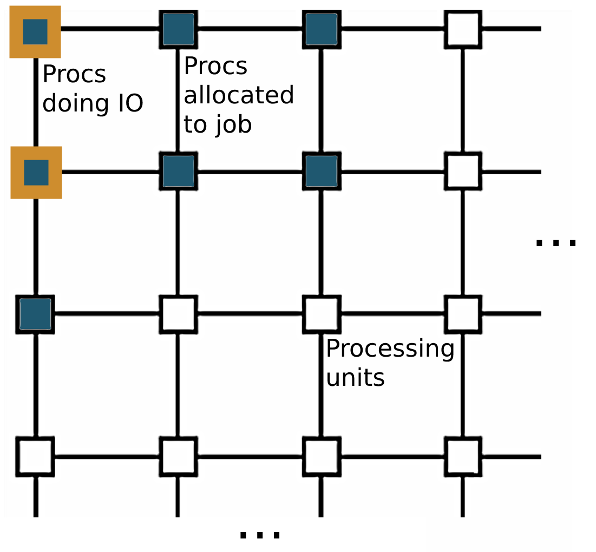
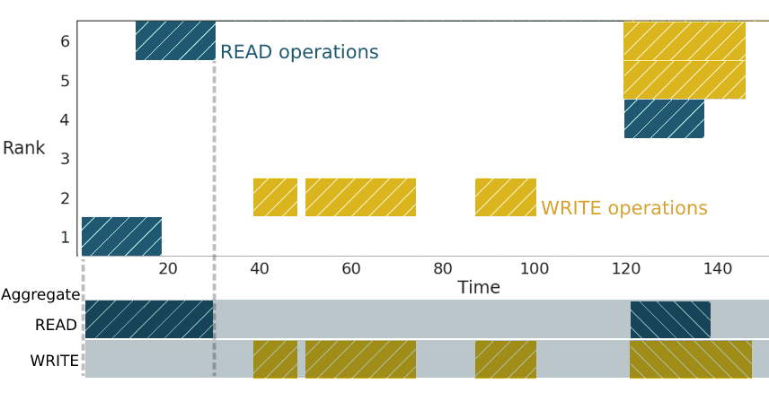

# Features description

A list of all features and a short description for each can be found in `features.desc.csv`.
The features from this file whose name is written in capital letters are defined by the Darshan log and are explained in the header of any Darshan log.
The rest are explained here.



Based on the figure above:
```
Total_nprocs      = number of blue boxes               // Total number of processing units
Total_nprocs_perc = blue_boxes / total_boxes	         // Ratio of total number of processing units	to total cores in the system
IO_nprocs         = number of orange outlined boxes    // Number of ranks doing any IO
IO_nprocs_perc	  = orange_outline_boxes / blue_boxes // Ratio of the total ranks doing any IO to total application ranks
```

 

Using the top part of the figure above (not the aggregated one):
```
IO_runtime = sum(all blue_regions) + sum(all orange_regions) / (total_application time * nprocs)
READ_after_READ = (number of blue regions that are not separated by orange regions) / (total number of blue regions)
WRITE_after_READ = (number of orange regions following blue regions) / (total number of orange regions)
WRITE_after_WRITE = (number of orange regions that follow orange regions) / (total number of orange regions)
Perc_ranks_READS = (number of lines that have a blue_region) / (number of lines that do any type of IO)
Perc_ranks_WRITES
Ranks_read_write
Ranks_read_only
Ranks_write_only
```

```
File_one_rank
File_multiple_ranks
Consecutive_rank_IO
Switched_rank_IO
Perc_overlap_access
READ_perc_overlap
WRITE_perc_overlap
```

Specific for POSIX
```
POSIX_read_write_bytes_perc
POSIX_read_only_bytes_perc
POSIX_write_only_bytes_perc
POSIX_unique_bytes_perc
POSIX_shared_bytes_perc
POSIX_unique_files_perc
POSIX_shared_files_perc
POSIX_IO_total_bytes
POSIX_IO_total_accesses
POSIX_IO_total_files
POSIX_IO_OPENS
POSIX_read_only_files_perc
POSIX_read_write_files_perc
POSIX_write_only_files_perc
```
