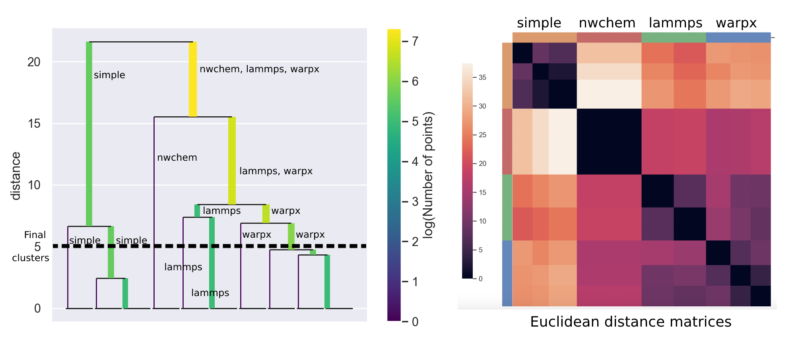

# Analyzing the IO logs

Two step analysis:
  - Extract the list of features from the raw Darshan logs
  - Create clusters with applications with similar patterns

**Required packages to test the scripts in this repo**

 - For plotting: python package `seaborn`
 - For feature extraction: python package `lightgbm`
 - For extracting the distance matrix: python packages `sklearn`, `dataset`, `hdbscan`
 - For the feature importance list: `libomp` and python package `xgboost`
 
All the dependencies with their versions are written in `requirements.txt`.
To install them, you will need `pip`. Run `pip install -r requirements.txt`.
It is recommended that you do this inside a virtual environment like `virtualenv` though.

## Extract the feature list

### 1. Extract the list of applications

Scripts available in folder `extract_logs`.

List of applications that generated the Darshan logs we will analyze. The list of application will be annotated by the field it is part of (example XGC is fusion, CANDLE is AI etc).

For Summit application, the `extract_job_info.sh` script is used to extract the list of applications.

### 2. Parse all the darshan logs

Scripts available in folder `extract_logs`.

And create a log that follows the format needed by the python scripts used to extract features.
For Summit, we use the `extract_logs.sh` script to extract all the darshan logs in a given timeframe and containing a keyword (either application name or user or none).
In the current configuration, the script extracts all the logs between September and December for user againaru.

The darshan files need to be parsed with the `--file` option followed by the default option in order to be usable by the python scripts:

```bash
darshan-parser --file ${darshan_log} > logs/${filename}.log
darshan-parser ${darshan_log} >> logs/${filename}.log
```

### 3. Extract the list features

Scripts available in folder `features`.

From each darshan log and store them in the same file.

```bash
for i in logs/*.log; do
    python extract_feature_list.py $i summit_againaru_features.csv; 
done
```

## Create clusters of similar data

Scripts available in folder `clustering`.



`extract_clusters.py` saves the main division in `*.0.csv` with labels from 0 to n-1
and saves each split into different files, one for each split distance (binary labels only for the dataset involved in the split)
