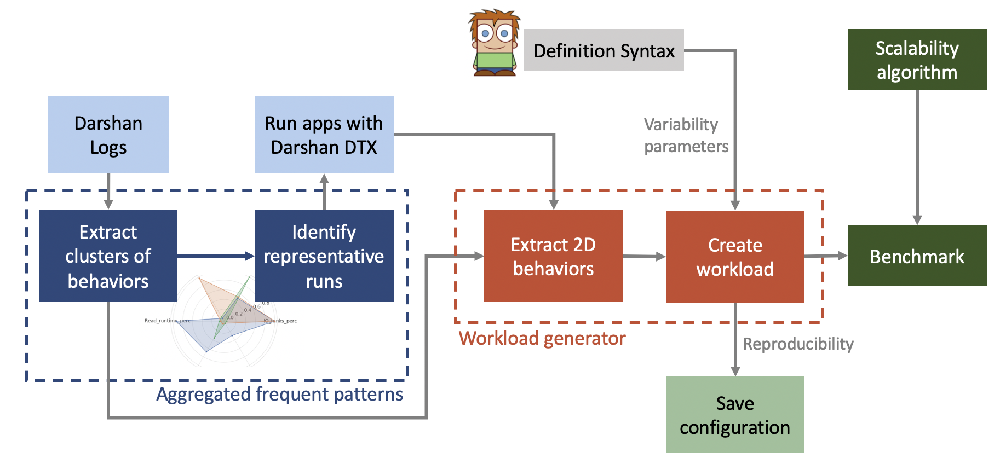
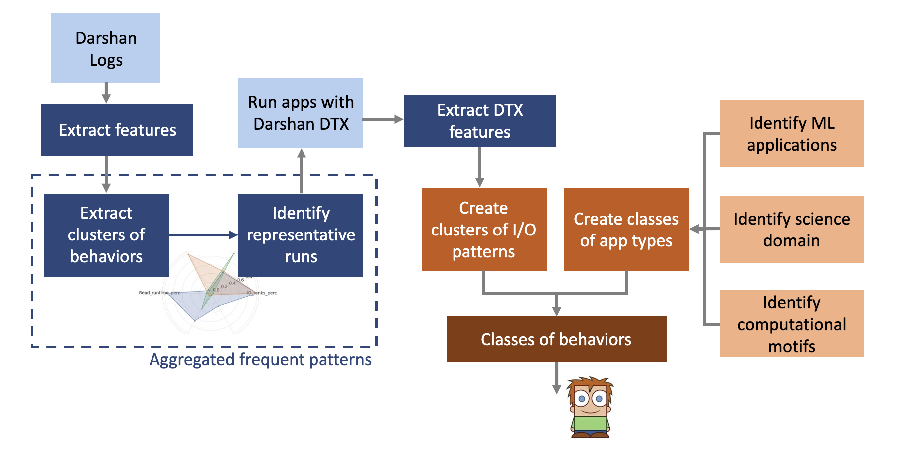

# IO benchmark



Running using Docker file:

```
docker build .
docker images
docker run -it --mount type=bind,source="/Users/95j/work/olcf_darshan/skel-io",target="/home/skel-io" --name skel-io [image_id] bin/bash
```

## Workflow generator

Darshan logs are used to create clusters
- Identify representative runs for the clusters (smaller possible set that covers the characteristics of the cluster)
- Re-run the representative cases with DTX activated

**Output: 2D behaviors** 
- Extend each cluster with timestamp information
- For each IO transfer, we will have some associated variability
- Depending on the degree of variability we might need to split the cluster

Based on the 2D behavior and input from the user
- Create a workload for the benchmark

## Methodology 



1. Extract I/O patterns
- Use historic logs for each application of interest (Darshan logs)
- Create a list of features
- Extract clusters of behavior for each application

2. Create clusters of I/O patterns
- Identify representative runs
- Run applications with DTX enabled
- Extract DTX features
- Create overall clusters of behavior between all applications

3. Analyze the clusters
- Detect if application i is using ML or not
- Identify science domain and computational motifs for each
- Analyze the patterns of each cluster in relation to the identified classes

4. Analyze shifts in behavior 
- Based on ML / non-ML
- Based on computational motifs
- Within each science domain


## Time series analysis
- Darshan limitations
- Include TAU / Recorder
- Plot time series behavior for cluster with each
